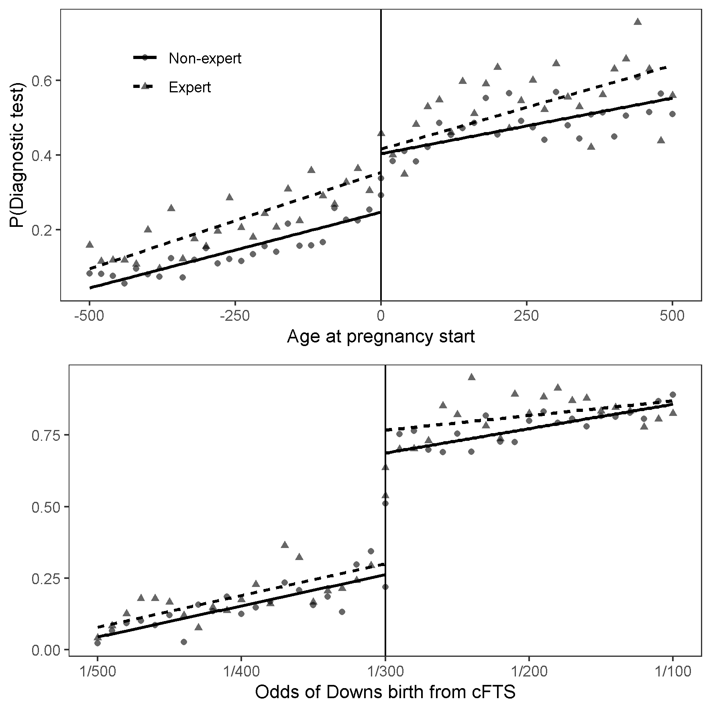

### Work in progress 
___

:::: {style="display: grid; grid-template-columns: 1fr 1fr; grid-column-gap: 10px;"}

::: {}

**Fertility and labour market outcomes: evidence from prenatal screening information**

  * [Working paper](https://www.dropbox.com/s/d9nh5043keb87os/main.pdf?dl=0) 

<ion-icon name="add-circle-outline"></ion-icon >

<button class="btn btn-primary" data-toggle="collapse" data-target="#BlockName"> Abstract </button>  

  

In this paper I study the labour market effects of having additional children. I find
a limited impact of going from two to three children using a novel source of exogenous
variation in family size stemming from prenatal screening information. In a regression
discontinuity design I compare women across the age 35 threshold in Danish prenatal
screening guidelines at which women where informed of their age related risk of having
a child with Downs syndrome. Women just over the threshold during the pregnancy
for their second child reduced subsequent fertility by 15% but had similar labour market
outcomes 1 to 10 years following the birth of the second child. Using twinning and the
sex-composition as instruments for fertility I find similarly small effects of the third
child. This is robust evidence of the external validity of the limited impact of fertility
at the intensive margin as the three strategies applies to different compliers.

:::

::: {}

:::

::::

___

:::: {style="display: grid; grid-template-columns: 1fr 1fr; grid-column-gap: 10px;"}

::: {}

**Do the guidelines apply to me? Physician agency in prenatal diagnostics** (With Jane Greve and Søren Kristensen)

  * Working paper *Coming soon*
  * [Poster HESG 2012](Poster_Nis_Lydiksen.pdf) 
  
<ion-icon name="add-circle-outline"></ion-icon >

<button class="btn btn-primary" data-toggle="collapse" data-target="#BlockName2"> Abstract </button>  

  

  *Background*  Patients who themselves have medical expertise have been found to receive care that is systematically different from care provided to non-expert patients. However, the current literature has been unable to ascertain whether the differences are due to expert patients sending less noisy signals about their preferences or health state than non-experts (statistical discrimination theory)  or whether experts use their informational advantage to demand better care than non-expert patients (agency discrimination theory). 

*Aim* We investigate the extent to which care provided to medically trained mothers is more likely to bypass clinical guidelines intended to ration access to prenatal diagnostic testing (PDT) compared to not medically trained mothers. Moreover, we examine whether a change in guidelines affected the differences in care offered to expert and non-expert patients.  

*Methods* We use a differences-in-discontinuities design to estimate the difference in the use of PDT between expert and non-expert mothers on the margin of a guideline threshold. We measure baseline preferences as the difference above the threshold, where all patients are offered PDT. Controlling for this baseline difference in preferences, we estimate expert “overuse” as the difference in the differences above and below the threshold. Prior to 2004, the threshold was age based (35 years) and after 2004 risk based (risk >1:300). We use exact matching to compare mothers with similar levels of education and income levels. 

*Data* Linked Danish administrative data on the use of PDT, age, gender, ethnicity, education, and family income from 51,204 mothers aged 33-37 giving birth from 1996 through 2002 and 23,211 mothers giving birth from 2008 through 2018. 

*Results*  We find a 7.4 percentage points overuse difference between expert and non-expert mothers when the age-based threshold applied. Overall, 70\% of the difference in PDT is due to expert “overuse”. Expert and non-expert patients have similar test-rates above the threshold, indicating that the differences below the threshold are not driven by differences in preferences. After the risk-based threshold was introduced, the difference in PDT almost disappears.

*Conclusion* In a national health service where maternity care is free at the point of delivery, but rationed by clinical guidelines, expert mothers bypass guidelines intended to limit access to costly prenatal diagnostic testing indicating that the difference in care between experts and non-expert motherss is due to agency discrimination.

 

 
  
:::

::: {}

:::

::::
___

:::: {style="display: grid; grid-template-columns: 1fr 1fr; grid-column-gap: 10px;"}

::: {}

**The Impact of Antidepressant Use on Socioeconomic Outcomes of Treated Individuals and Their Families** (With Sonia Bhalotra, Meltem Daysal and Mircea Trandafir)

  * Working paper: Coming Soon

:::

::: {}

:::

::::

___

